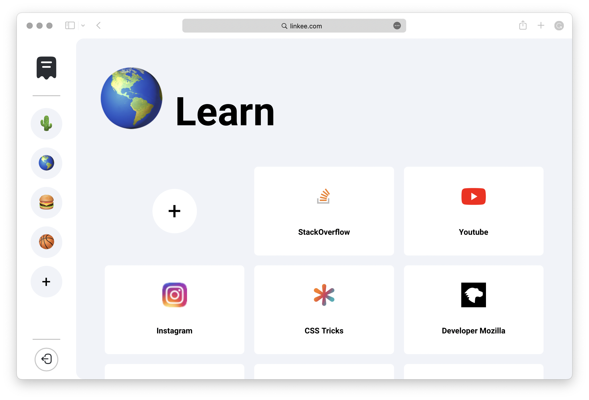

# Linkee
#### Video Demo: https://youtu.be/KwxiPyfwPm4
#### Description:

I would like to introduce you to the idea of this project. It comes from a problem that I have been experiencing for a very long time, which is the difficulty of saving links of interest that I don't want to lose. Chrome's bookmark feature doesn't scale well when it comes to managing a large number of links, plus it offers a poor graphical interface and that is what makes it difficult to find what you are looking for. Due to these difficulties and the fact that I don't know of any other options that do what I need, I decided to create my own solution.

My project is an application to store links to web pages, creating individual cards for each one, sorted into different groups for better organization and distinction of its content.

To make it as graphic and accessible as possible, the sections are identified with an emoji of the user's choice and each link shows the icon of the page to which it leads as well as a name provided at the time of its creation.

To keep the graphic section as clean as possible, the buttons to delete elements will only be shown when you hover the mouse over them, this works for both links and sections.

Once logged into the app, the web page will never need to reload. All the requests to the server are made through javascript, by fetching data, allowing a much more fluid use.

The biggest difficulty I encountered was to allow the user to choose which emoji to show in each section, for this I needed a variable with a list of all the emojis separated by comma. To get this list I made a Python script that receives an `emojis.csv` file and then prints the corresponding list.

```python
import csv

with open('emojis.csv', newline='', encoding="utf8") as csvfile:
    spamreader = csv.reader(csvfile, delimiter=' ', quotechar='|')
    final = "["
    for row in spamreader:
        c = row[0][0]
        if c != ' ' or c != '':
            final += "'"
            final += row[0][0]
            final += "', "
    final += "]"

    print(final)
```

*CSV file from https://gist.github.com/bfeldman89/fb25ddb63bdaa6de6ab7ac946acde96f.*

## Technologies used:
* flask
* sqlite3
* sass

## File structure
* 📁 `static` - Contains all static files.
    * 📁 `css` - Contains all CSS and SCSS files.
        * 📄 `_feedback.scss` - Responsible for providing feedback to the user when using the application.
        * 📄 `_fonts.scss` - Sets the font to use as well as its different sizes and weights.
        * 📄 `_reset.scss` - Resets the styling to a consistent baseline.
        * 📄 `styles.css` - Compiled file from Sass.
        * 📄 `styles.css.map` - Compiled file from Sass.
        * 📄 `styles.scss` - Main sass file where most of the styles used in the application are located.
    * 📁 `icon` - Contains all icons used in the application.
        * 🖼️ `logo.svg` - Application icon displayed in `index.html` and used as favicon.
        * 🖼️ `logout.svg` - Logout icon displayed in `index.html`.
        * 🖼️ `trash.svg` - Icon shown in different elements to allow their deletion.
    * 📁 `js` - Contains all JavaScript files.
        * 📄 `helpers.js` - This script executes secondary functions that were separated from `script.js` to give it a cleaner look.
        * 📄 `login.js` - This script runs in `login.html` template and allows the user to switch between login and registration view.
        * 📄 `script.js` - This script runs in `layout.html` template. It fetches data from `app.py` and generates all the sections and links for each user. In addition to managing requests when the user creates a new element.
    * 🖼️ `hero.png` - Preview image of the application displayed in `login.html` template.
* 📁 `templates` - Contains all HTML files.
    * 📄 `index.html` - This template contains the application.
    * 📄 `layout.html` - Base template for `index.html` and `login.html`.
    * 📄 `login.html` - This template contains the login and registration forms.
* 📄 `app.db` - sqlite3 database.
* 📄 `app.py` - Declares all the paths for the applications and functions that provide data for `script.js`.
* 📄 `databases.sql` - Contains all the create commands for the tables used in the database.
* 📄 `helpers.py` - Defines the `@login_required` decorator for `app.py`.

## Possible improvements
Like all applications, this one also has room for improvement. Some possible improvements:
* Ability to drag and drop items to change the order in which they are displayed.
* Animations to smooth the process of creating and deleting links and sections.
* Ability to change email, password, and other account information.

## How to run the application
1. Clone or download the repository.
2. If you don't have flask installed, install it by running `pip3 install flask`.
3. Same thing with `cs50` and `Werkzeug`.
4. Open your terminal and `cd` into the main directory.
5. Run `flask run` to start the web server.
6. Open the link in your browser and that's all!

## Preview

